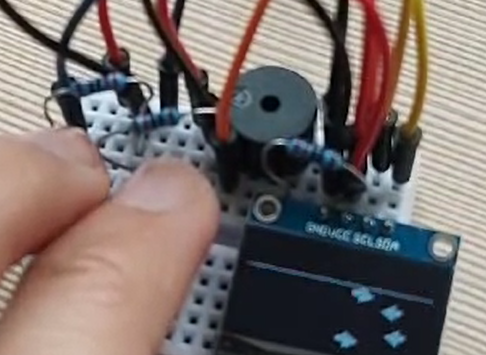

# StepMania ESP32

Small game project using ESP32 with a 0.96'' display module and push buttons. In the game, arrows spawn randomly and go up the screen. When they approach the limit line, the player must press the correct button to score a point. If a player misses an arrow, it's game over!

Please check the [project YouTube demo](https://youtu.be/9LU-Igz2qgw).

Credits for the Pirates of the Caribbean theme song playing on the buzzer to [Xitang Zhao](https://github.com/xitanggg/-Pirates-of-the-Caribbean-Theme-Song).

## Pinout

- Pins 21/22 for display SDA/SCL;
- Pins 25/26 (D2/D3) for left/right push button;
- Pin 14 (D6) for buzzer.

